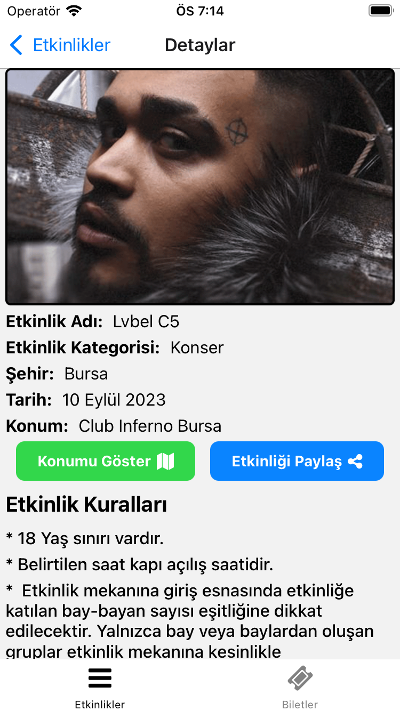
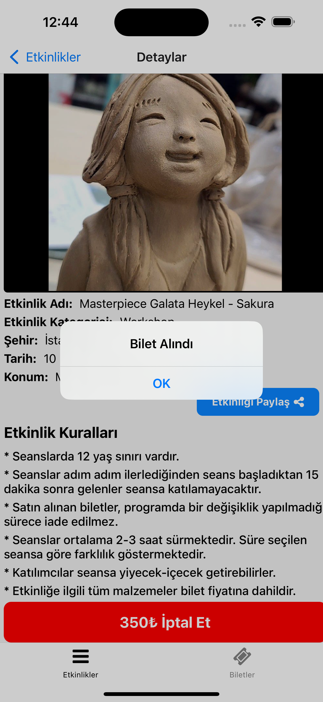
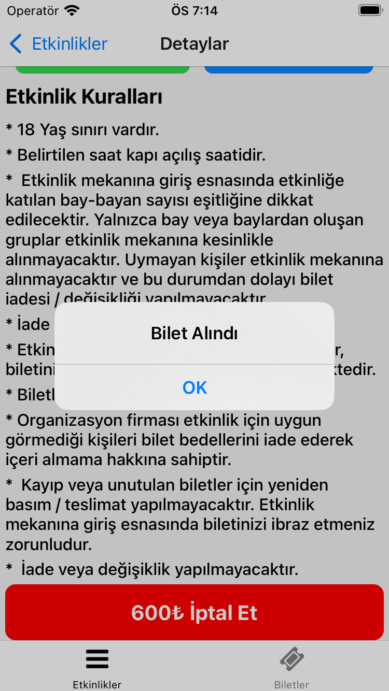

# Tech Career React-Native Final

- If it's not already installed, let's first install [json-server](https://www.npmjs.com/package/json-server).

```sh
npm install -g json-server
```

- Let's clone the project.

```sh
git clone https://github.com/admrts/techcareer-RN-bootcamp.git
```

- The cd the project directory

```sh
cd techcareer-RN-bootcamp
```

- Install node_modules

```sh
npm install
```

- Start Json-Server

```sh
npm run start:server
```

- Start Metro

```sh
npm start
```

- New terminal and Start App on Simulator

```sh
npm run ios
// or
npm run android
```

### ScreenShots

 
 
 
 
